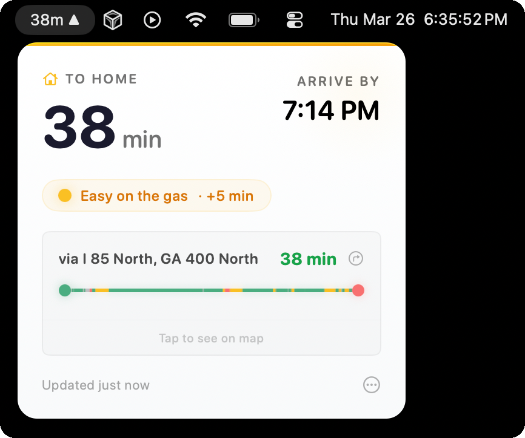

# Arrival

**Your drive time, at a glance.**

Arrival is a free, open-source macOS menu bar app that shows your commute time in real time. It lives next to your clock, color-coded so you can make a decision in half a second — no app to open, no map to load.

**[Website](https://arrival-app.vercel.app/)** · **[Documentation](https://arrival-app.vercel.app/docs/)** · **[Download](https://github.com/kevinguebert/traffic-menubar/releases/latest)**



## Features

- **Live commute duration** right in your menu bar
- **Color-coded traffic moods** — green (clear), amber (moderate), red (heavy) — so you know at a glance
- **Smart direction detection** — automatically shows "to work" in the morning and "to home" in the evening based on your commute schedule
- **Detachable map window** — pop out an interactive map that floats above your workspace
- **Route alternatives** — up to 3 routes with real-time comparison
- **Adaptive polling** — checks more frequently during commute hours, less often off-peak
- **Auto-updates** via Sparkle

### Works out of the box with Apple Maps

Arrival uses **Apple Maps (MapKit)** by default — no API key, no account, no setup beyond your addresses. You get live travel times, route paths on the map, and traffic moods immediately.

### Optional: Unlock more data with Mapbox

If you want deeper traffic insight, you can add a free [Mapbox](https://www.mapbox.com/) API key in Preferences. Mapbox gives you:

- **Per-segment congestion coloring** — see exactly which stretch of road is backed up (green/amber/red overlaid on the route)
- **Traffic incident alerts** — accidents, construction, closures with severity levels
- **Accurate free-flow baselines** — compare current travel time against a precise no-traffic estimate instead of a heuristic

Mapbox offers a generous free tier (100,000 directions requests/month), which is more than enough for personal commute tracking.

## Requirements

- macOS 13.0 (Ventura) or later

## Installing via DMG

Download the latest `.dmg` from [Releases](https://github.com/kevinguebert/traffic-menubar/releases), open it, and drag Arrival to your Applications folder.

**First launch:** Right-click the app and select Open (required once for unsigned apps).

## Installing via Homebrew

```bash
brew install --cask arrival
```

## Configuration

On first launch, Arrival opens Preferences automatically. Set up your commute:

1. **Set your home and work addresses** — Arrival geocodes them so full street addresses work best
2. **Configure your commute schedule** — morning and evening windows so direction detection works automatically
3. **Optionally add a Mapbox API key** — go to the General tab → Traffic Provider section → "I have a Mapbox key" to unlock per-segment congestion data and incident alerts

All settings are stored locally on your Mac.

## Building from Source

Arrival uses [XcodeGen](https://github.com/yonaskolb/XcodeGen) to generate its Xcode project.

```bash
# Install XcodeGen
brew install xcodegen

# Set up secrets (Sentry DSN + TelemetryDeck App ID)
cp Secrets.xcconfig.example Secrets.xcconfig
# Edit Secrets.xcconfig with your values (or leave defaults to build without analytics)

# Generate the Xcode project
xcodegen generate

# Open in Xcode
open Arrival.xcodeproj
```

Then build and run with **Cmd+R** in Xcode.

## Creating a Release

Push a version tag to trigger the GitHub Actions release workflow:

```bash
git tag v1.0.0
git push origin v1.0.0
```

This builds the app, creates a DMG, publishes a GitHub Release, and updates the Sparkle appcast.

## License

[MIT](LICENSE)
